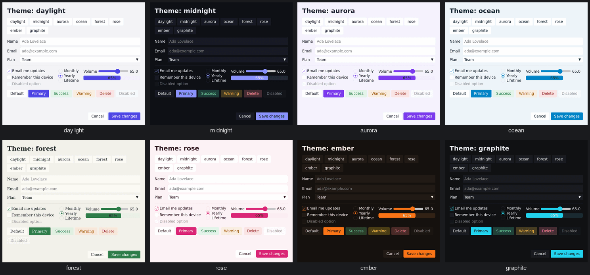
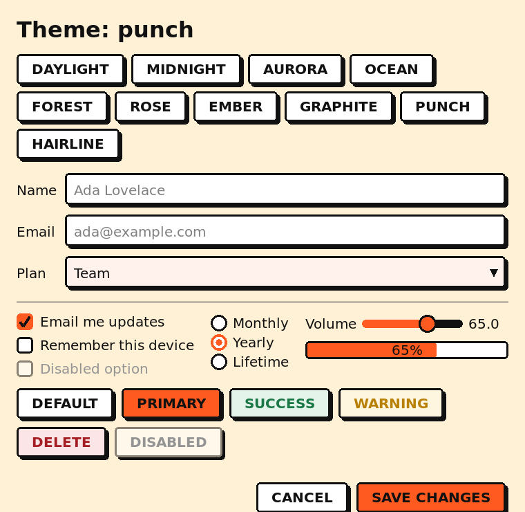
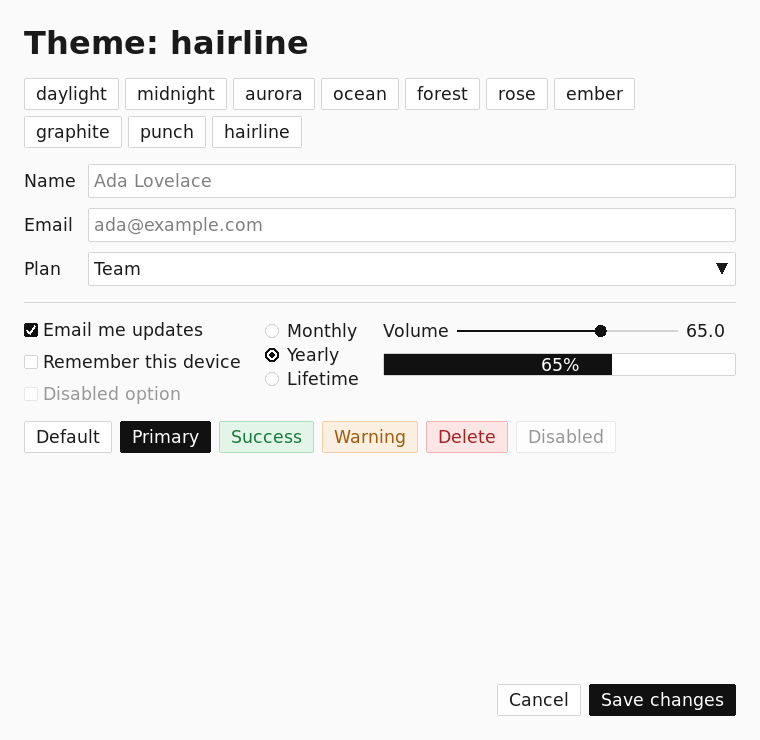

# RUI2 — Reactive UI Framework for Nim

**Fast, lightweight, immediate-mode-with-caching GUI toolkit for Nim, built on raylib.**

> ⚠️ **Alpha / work in progress.** The architecture is solid and the core widgets
> compile and run, but not every feature is wired yet. APIs may change. See
> [STATUS.md](STATUS.md) for an honest, feature-by-feature breakdown before you
> rely on anything.

RUI2 builds UIs from plain Nim: describe the widget tree with `ui:`, hold
state in `Link[T]`, let layout primitives place everything, and pick a branded
theme. A two-pass layout/render loop caches each widget to a texture, redraws
only what changed, and sleeps when nothing did.

```nim
import rui

let count = newLink(0)
var shown: Label
var minus, plus: Button

let root = ui:
  Padding(padding = EdgeInsets.all(24.0)):
    Column(spacing = 12.0):
      shown = Label(text = "", fontSize = 28.0, bold = true)
      Row(spacing = 8.0, mainAxisSize = MainAxisSize.min):
        minus = Button(text = "-").frame(minWidth = 48)
        plus = Button(text = "+", intent = ThemeIntent.Info).frame(minWidth = 48)
      Spacer()                                # pushes the footer down
      Label(text = "Built with RUI2", fontSize = 12.0)

count.bindTo(shown, proc(v: int) = shown.text = "Count: " & $v)
minus.onClick = proc() = count.set(count.get() - 1)
plus.onClick = proc() = count.set(count.get() + 1)

let app = newApp("Counter", 400, 300)
app.setTheme("aurora")
app.setRootWidget(root)
app.run()
```



## The actual API

Everything is regular Nim -- no hidden globals you have to know about, no
code generation step.

- **Trees** -- `ui:` builds a tree from its shape; a capitalised call is a
  widget and an indented block is its children. It is sugar over the
  constructors (`newColumn(...)`, `addChild`), which you can use directly.
- **State** -- `newLink(value)`, `link.get()` / `link.set(v)`.
  `link.bindTo(widget, proc(v: T) = ...)` keeps a widget in step, repainting
  only the widgets bound to that link.
- **Handlers** -- plain closures: `button.onClick = proc() = ...`.
- **Layout** -- Flutter's model and names, so a Flutter developer is at
  home: `Row` / `Column` / `Flex` with `mainAxisAlignment`,
  `crossAxisAlignment`, `mainAxisSize`; `Expanded`, `Flexible`, `Spacer`;
  `Padding`, `SizedBox`, `ConstrainedBox`, `Align`, `Center`, `Container`
  (with a `BoxDecoration`); `Stack` + `Positioned`; `Wrap`; `Table` with
  `FixedColumnWidth` / `IntrinsicColumnWidth` / `FlexColumnWidth`;
  `GridView`. Plus `Dock` for app windows and `ScrollView`. A widget never
  writes its own position; it can *ask* for size with
  `.frame(width = 300, minHeight = 40)`. `VStack`/`HStack`/`ZStack` remain
  as stretch-by-default shorthands.
- **Themes** -- `app.setTheme("daylight")`: daylight, midnight, aurora,
  ocean, forest, rose, ember, graphite, plus two at the extremes of
  geometry: **punch** (fat -- 3px ink outlines, hard offset shadows that
  buttons sink into, bold capitals, big controls) and **hairline** (thin and
  lean). A theme sets colours and fonts but also stroke width, corner radius,
  padding, caption weight and case, drop shadow and control sizes, and every
  widget reads them. Your own brand is one call:
  `brandTheme(BrandSpec(name: "Acme", accent: hex"#E4572E", borderWidth: 3,
  shadow: 4, boldCaptions: true, ...))`, or the same fields in a theme file.
  See `examples/widgets/theme_gallery.nim`.

  | punch (fat) | hairline (lean) |
  |---|---|
  |  |  |

- **App lifecycle** -- `newApp(title, width, height, fps = 60, resizable = true,
  minWidth = 320, minHeight = 240)`, then `app.setRootWidget(root)` and
  `app.run()`.

## Defining your own widgets

Two macros generate the widget boilerplate (type, constructor, methods). They
share the same section format — `props`, `state`, `actions`, `events`, plus
`render` (primitives) or `layout` (composites):

```nim
# A leaf that draws itself with drawing primitives
definePrimitive(Label):
  props:
    text: string
    fontSize: float = 14.0
    color: Color = BLACK
  render:
    drawText(widget.text, widget.bounds, ...)

# A composite that arranges/creates children
defineWidget(SimpleColumn):
  props:
    spacing: float = 8.0
    padding: float = 0.0
  layout:
    var y = widget.bounds.y + widget.padding
    for child in widget.children:
      child.bounds.x = widget.bounds.x + widget.padding
      child.bounds.y = y
      child.bounds.width = widget.bounds.width - widget.padding * 2
      child.layout()
      y += child.bounds.height + widget.spacing
```

See [ARCHITECTURE.md](ARCHITECTURE.md) for the full `definePrimitive` vs
`defineWidget` distinction and every section.

## What works today

Widgets that compile and run: **Label, Rectangle, Circle, Button, Checkbox,
RadioButton, Slider, ProgressBar, Hyperlink, Image, TextInput/TextArea,
ComboBox, lists, trees, tables, dialogs** and the Flutter layout set
(**Row, Column, Flex, Expanded, Flexible, Spacer, Padding, SizedBox,
ConstrainedBox, Align, Center, Container, Stack, Positioned, Wrap, Table,
GridView, Dock, ScrollView**). See STATUS.md for the authoritative list.

## Installation

RUI2 targets the [naylib](https://github.com/planetis-m/naylib) raylib binding.

```bash
git clone https://github.com/kobi2187/rui2
cd rui2
nimble install naylib yaml
```

Dependencies:

- **Nim** ≥ 2.0
- **naylib** — raylib binding (provides the bundled raylib)
- **yaml** — used for theme loading

The repo is a monorepo of packages (below); the root `config.nims` wires them up
for local development, so examples just `import rui`:

```bash
nim c -r examples/simple_counter_app.nim
```

RUI2 compiles and runs **graphics-only** against naylib (verified with
`nim check`). A headless mode was removed as a deferred future feature.

## Package layout

RUI2 is organised as **7 self-contained packages** under `packages/`, so each
subsystem can be used independently and later split into its own repository:

| Package          | Responsibility |
|------------------|----------------|
| `rui_core`       | Widget/Rect/Color/event types, `Link[T]`, two-pass main loop, `definePrimitive`/`defineWidget` macros |
| `rui_hittest`    | Generic interval tree + Widget-aware spatial hit-testing |
| `rui_events`     | Time-budgeted event manager + focus manager |
| `rui_drawing`    | Drawing primitives, effects, theme system (state × intent), text cache, theme-aware widget primitives |
| `rui_scripting`  | File-based GUI automation (query/set widget values) for testing |
| `rui_widgets`    | Concrete widgets: primitives, basic controls, containers |
| `rui` (umbrella) | `App` object + main-loop integrator + re-exports everything |

Each package has its own `.nimble` and `src/` barrel. The root `config.nims`
resolves them by bare name for local dev (`import rui`, `import rui_core`, ...).
To peel a subsystem into its own repo, see **[SPLITTING.md](SPLITTING.md)**.
Subsystems such as the interval-tree hit-tester, the event manager, and the theme
system are designed to stand alone.

## Documentation

- **[docs/tutorial.md](docs/tutorial.md)** — start here: a counter, a form and a
  data app, each a real program in `examples/tutorial/`.
- **[docs/themes.md](docs/themes.md)** and **[docs/preferences.md](docs/preferences.md)**
  — the author's look, and the user's own settings (keys, motion, scroll speed).
- **[docs/PERFORMANCE.md](docs/PERFORMANCE.md)** — what it costs, measured.
- **[ARCHITECTURE.md](ARCHITECTURE.md)** — design philosophy, two-pass
  layout/render, the DSL macros, `Link[T]`, theme system, managers, package graph.
- **[STATUS.md](STATUS.md)** — honest implementation status: what works, what's a
  roadmap item, known issues, next steps.
- **[TODO.md](TODO.md)** — the principles; the plan itself is in the GitHub issues (label `roadmap`).
- **[ROADMAP.md](ROADMAP.md)** — phased plan for what's next (correctness →
  reactivity → ergonomics → text → widgets → release).
- **[SPLITTING.md](SPLITTING.md)** — how to split each package into its own repo.

## License

MIT — see [LICENSE](LICENSE). Each package under `packages/` carries its own
copy, so it stays licensed after the split.
