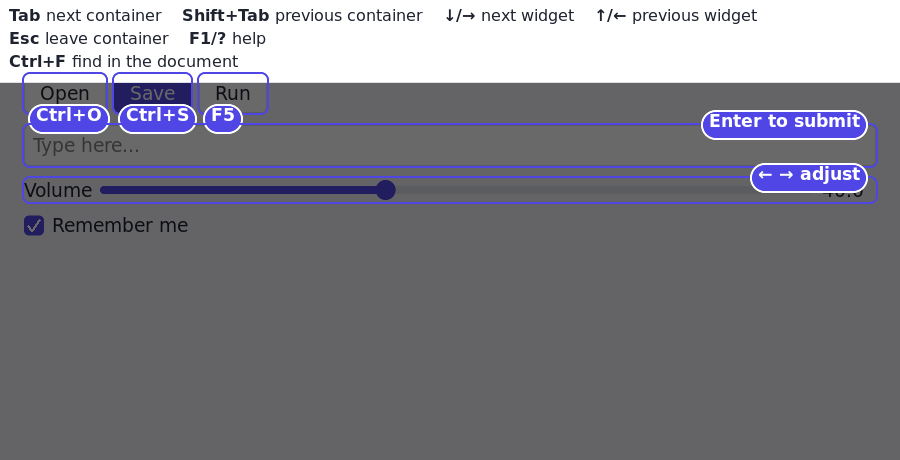

# Preferences

Two things shape how a RUI application behaves, and they belong to different
people:

| | Belongs to | Decides | Where |
|---|---|---|---|
| **Theme** | the application's author | looks, brand, the app's own behaviour | shipped with the app ([themes.md](themes.md)) |
| **Preferences** | you, the person using it | how *you* work with applications: navigation keys, motion, scroll speed, caret blink, double-click speed | one file, shared by every RUI app on your machine |

So every RUI application is used the same way on your machine, whatever its
author chose to make it look like. RUI keeps the defaults stable between
releases, and an application cannot override your settings -- it can read
them, but not change them.

## The file

| | |
|---|---|
| Linux | `~/.config/rui/preferences.yaml` (`$XDG_CONFIG_HOME` respected) |
| macOS | `~/Library/Application Support/rui/preferences.yaml` |
| Windows | `%APPDATA%\rui\preferences.yaml` |
| anywhere | set `RUI_PREFERENCES=/path/to/file` (YAML, or JSON if it ends in `.json`) |

It is read once, when an application starts. No file is normal: the defaults
apply. A file with mistakes is not fatal: each wrong setting keeps its default
and the problem is printed on stderr, so an application always starts.

```yaml
# ~/.config/rui/preferences.yaml -- everything here is optional
keys:
  nextGroup: [Tab, F6]          # on to the next container
  prevGroup: [Shift+Tab]
  nextInGroup: [Down, Right, J] # within a container
  prevInGroup: [Up, Left, K]
  leaveGroup: [Escape]
  showHelp: [F1, Shift+Slash]   # F1 or ?
motion: full                    # full | reduced (no animations)
scroll: 1.0                     # wheel multiplier, 0.1 to 10
caretBlinkMs: 500               # half a blink period; 0 keeps the caret steady
doubleClickMs: 400              # longest gap between clicks of a double-click
colorScheme: system             # system | light | dark
```

## Keyboard navigation

Navigation has two axes, each on its own keys:

- **Within a container** -- `nextInGroup` / `prevInGroup` step through its
  widgets; `leaveGroup` steps out of it, one level.
- **Between containers** -- `nextGroup` / `prevGroup` move on to the next or
  previous one.

A container is a stop when its author marked it a `FocusScope` (toolbars,
lists, radio groups and tab strips already are). Tab lands on a stop's first
widget, the within-container keys move inside it, and Tab moves on, so a
twenty-row list is one Tab stop, not twenty.

Chords are written as people say them -- `Tab`, `Shift+Tab`, `Ctrl+PageDown`,
`J` -- and match exactly (`Tab` does not fire on `Shift+Tab`). Listing an
action *replaces* its defaults; leave it out to keep them. If two actions share
a chord you are told which. A focused widget still gets first refusal on a key:
a text field keeps Left and Right for its caret even inside a container that
navigates with them.

## Help overlay

F1 or `?` (the `showHelp` action) shades the window. Along the top is one line
with the general navigation keys -- yours, not the defaults. Beside each widget
that has a shortcut is a badge with its keys. Any key or click closes it. A `?`
typed into a text field is just typing.



While you navigate by keyboard, the focused widget is ringed in the theme's
focus colour and the container it belongs to gets a softer ring round it; both
vanish when you use the mouse.

## For application authors

```nim
let app = newApp("Notes")       # reads the user's preferences; nothing to do
prefs.reduceMotion              # read-only: honour it in anything custom you animate
prefs.colorScheme               # offer a light and a dark theme; start on the one asked for
```

Say what a key does in the GUI itself, three ways:

```nim
Button(text = "Save").shortcut("Ctrl+S")      # a real key for this widget; its chord is the hint
Slider(...).hint("← → adjust")                # any note, shown beside the widget (binds nothing)
app.bindShortcut("Ctrl+F", "find", openFind)  # a key for the whole app; listed under the top line
```

The help overlay gathers every widget that has a hint, takes where it is on
screen and what it says, and draws a badge there. `app.addHelp(keys, text)` lists
a note that has no widget and no action.

Do not rebind navigation keys or override scroll and double-click speed: that
is the user's call, and being able to count on it is the point. Add your own
shortcuts (Ctrl+S) as widget key handlers; they do not compete with navigation.
`Animated` values respect `reduceMotion` automatically.
